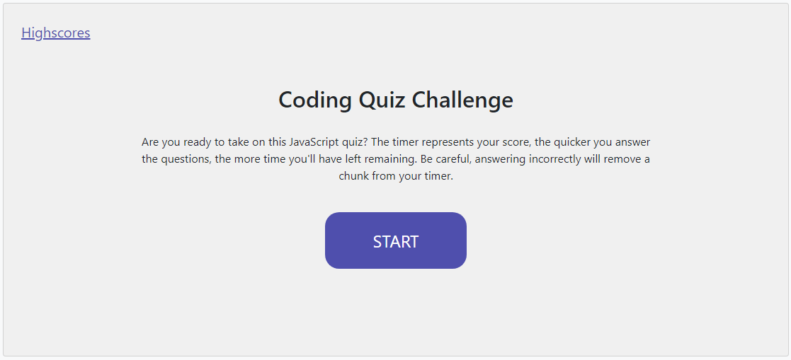
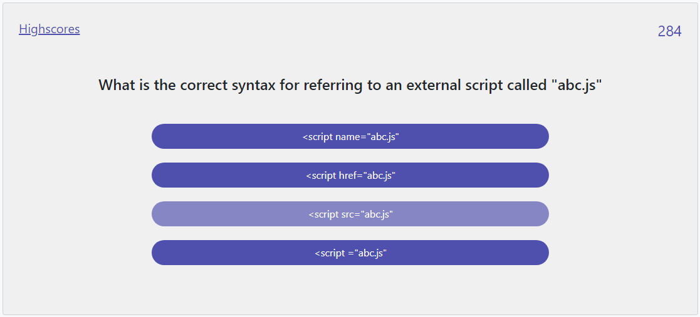
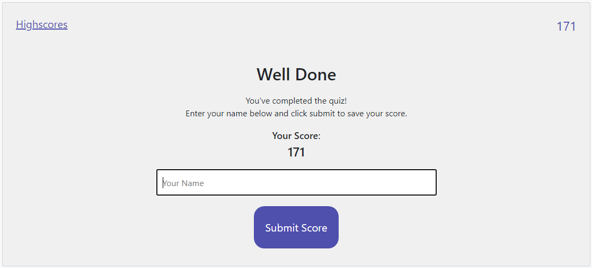

# Code-Quiz
04 Web APIs: Code Quiz

## Task Description

The task for this week's assignment was to create a JavaScript Coding Quiz using HTML, CSS, JavaScript along with the option to use jQuery. The quiz needed to include a timer and multiple choice questions. The timer also had to act as the player's score, with the timer (score) being reduced if a player answers a question incorrectly. After the final question is answered, the timer stops and that becomes the player's final score. The player is then presented with an input field to enter their name and a submit button for them to enter their score to the highscores list on a separate page.

## Quiz Home Screen

I started this task by creating a homescreen for the quiz and a timer function. The homescreen features a little bit of info about the quiz and a start button, which when clicked, presents the player with the first question and starts the timer. I made use of constants such as MAX_TIME_LIMIT (sets the starting amount for the timer) & TIME_PENALTY (the amount of seconds the timer is reduced by when an incorrect answer is selected) a few times throughout my code. I decided to use constants intead of inputting direct numbers because it would be easier to change multiple lines of code by just changing the value of the constants, rather than going through to find all the correlating places to update the number.

## Questions

The next step I took was to create a new javascript file to hold all of my questions. I stored all the questions as objects inside of an array called "questions". Each question object had three values; question, options & answer. I used jQuery to hide and display different html elements throughout the quiz, including when changing question. I made sure that the player is presented with the next question reglardless if the selected the correct answer or an incorrect answer, as long as there were still questions left in the "questions" array.

## End Screen

Once the player has answered all the questions (and if there is still time left on the timer), the timer will stop and that will become the players final score. The player is then presented with an end screen featuring an input field and submit button. When the player hits submit, the Quiz will take their inputted name and final score and display it on a separate HTML page called Highscores.

## Highscores Page

The highscores are saved using localStorage inside the player's browser and displayed as list items inside a unique list HTML element. The page also featuers a "Back" button, which will let take the player back to the Homescreen to let them play again and try and beat their highscore. There is also a "Clear" to clear all of the highscores. One thing I have not had a chance to attend to yet is getting the highscores list to display in order of high to low, however this is something I can definitely improve on when coming back to this code in the future.
